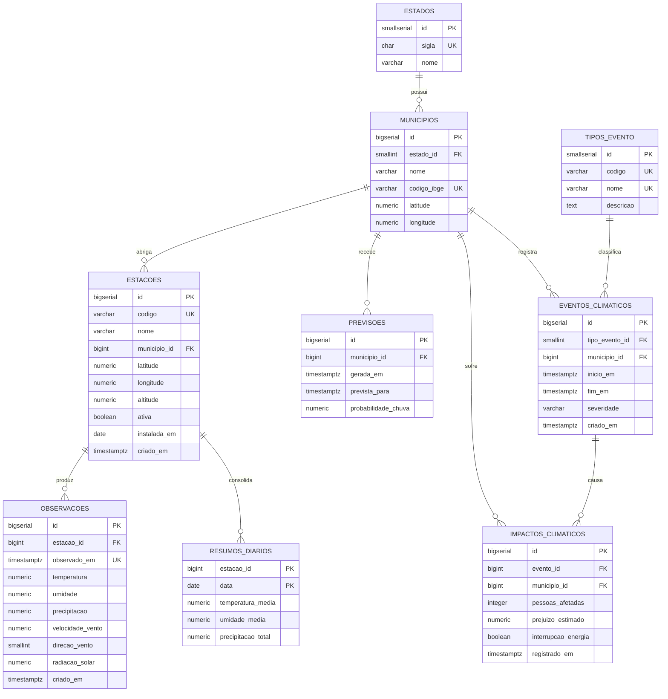
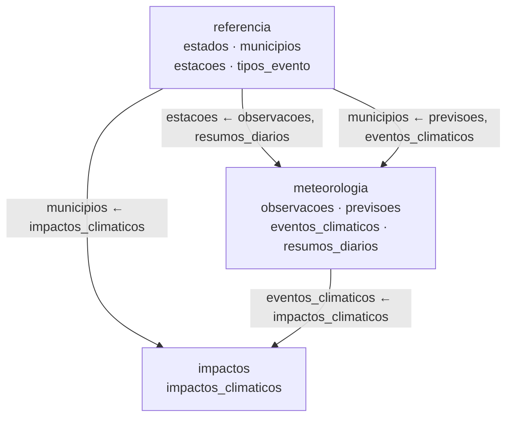

# Base de demonstração — Meteorologia e Impactos Climáticos

Documento de referência técnica do banco PostgreSQL externo utilizado como
cenário de demonstração, validação e avaliação de desempenho da plataforma.

Scripts em [`infra/demo-database/`](../infra/demo-database/).

---

## 1. Objetivo da base

A ferramenta desenvolvida neste trabalho publica endpoints REST a partir de
consultas SQL sobre bancos PostgreSQL de terceiros. Para exercitá-la é
necessário um banco externo real, com estrutura suficientemente rica e volume
que possa crescer de forma controlada.

**Por que meteorologia.** O domínio foi escolhido por três razões:

1. **Volume nasce da natureza do domínio.** Estações meteorológicas medem
   continuamente. O número de registros é função de estações × frequência ×
   tempo, e cresce sem que a modelagem precise mudar. Não é necessário
   inventar um motivo artificial para a base ficar grande.
2. **Consultas são naturalmente parametrizadas.** Recortes por estação, por
   município e por intervalo de tempo são o uso normal do domínio — exatamente
   o formato de endpoint que a plataforma publica.
3. **A estrutura é heterogênea sem ser artificial.** Tabelas de referência
   pequenas, séries temporais grandes, agregações diárias e registros
   episódicos de evento e impacto coexistem naturalmente, cobrindo os recursos
   que a introspecção precisa reconhecer.

**Uso na validação da ferramenta.** A base exercita a introspecção implementada
no M2 (múltiplos schemas, chave primária composta, chaves estrangeiras entre
schemas, views, CHECKs, defaults) e servirá de origem para as Saved Queries e
os endpoints dinâmicos das milestones seguintes.

> **Os dados são sintéticos.** São gerados por expressões determinísticas nos
> scripts de carga. Não provêm do INMET, da NASA, da NOAA ou de qualquer
> serviço meteorológico, não descrevem condições atmosféricas reais e não devem
> ser usados para qualquer decisão operacional. Os nomes de município são
> fictícios e os códigos "IBGE" são sintéticos, sem correspondência com a
> tabela oficial. As siglas e os nomes das unidades federativas são reais,
> por serem apenas rótulos geográficos de referência.

---

## 2. Visão geral

| Item | Valor |
|---|---|
| Banco | `gerador_api_demo` |
| Container | `gerador-api-demo-db` |
| Host / porta | `127.0.0.1` : `5435` (5432 dentro do container) |
| Usuário | `demo` |
| Schemas de domínio | 3 |
| Tabelas | 9 |
| Views | 2 |
| CHECK constraints | 24 |
| Índices (incluindo os de PK e UNIQUE) | 28 |

| Schema | Responsabilidade |
|---|---|
| `referencia` | Dados estáveis e de baixo volume: recortes geográficos, cadastro de estações e domínio dos tipos de evento. Mudam raramente. |
| `meteorologia` | Séries temporais e ocorrências: observações, previsões, eventos climáticos e agregações diárias. Concentra o volume. |
| `impactos` | Consequências socioeconômicas atribuídas a eventos climáticos. Depende de `meteorologia` e de `referencia`. |

O schema `public` permanece vazio de tabelas de negócio, deliberadamente: a
separação em três schemas é o que permite validar a introspecção em ambiente
multi-schema.

### Carga inicial

Volume produzido por [`04-seed.sql`](../infra/demo-database/04-seed.sql).
São todos **dados sintéticos**, gerados por expressões determinísticas.

| Tabela | Registros |
|---|---|
| `referencia.estados` | 27 |
| `referencia.municipios` | 81 |
| `referencia.estacoes` | 90 |
| `referencia.tipos_evento` | 6 |
| `meteorologia.observacoes` | **43.200** |
| `meteorologia.resumos_diarios` | 1.890 |
| `meteorologia.previsoes` | 405 |
| `meteorologia.eventos_climaticos` | 81 |
| `impactos.impactos_climaticos` | 121 |

As observações correspondem a 90 estações × 20 dias × 24 horas, uma medição por
hora para cada estação, e ocupam cerca de 8,4 MB com os índices.

---

## 3. Diagrama entidade-relacionamento



Todas as relações são 1:N (`||--o{`): o lado "muitos" é opcional, já que um
município pode não ter estação e um evento pode não ter impacto registrado.

---

## 4. Mapa de dependência entre schemas



A dependência é acíclica e sempre no sentido `referencia → meteorologia →
impactos`. Nenhuma tabela de `referencia` aponta para os demais schemas, o que
permite carregar e truncar os dados em ordem previsível.

---

## 5. Dicionário de dados

### 5.1 `referencia.estados`

Unidades federativas. Raiz da hierarquia geográfica.

- **PK:** `id`
- **UNIQUE:** `sigla`
- **Relacionamentos:** 1:N com `referencia.municipios`

| Coluna | Tipo | Obrigatório | Restrição | Descrição |
|---|---|---|---|---|
| id | SMALLSERIAL | Sim | PK | Identificador da unidade federativa |
| sigla | CHAR(2) | Sim | UNIQUE | Sigla de duas letras |
| nome | VARCHAR(100) | Sim | — | Nome por extenso |

### 5.2 `referencia.municipios`

Municípios vinculados a uma unidade federativa. Serve de recorte geográfico
para previsões, eventos e impactos.

- **PK:** `id`
- **FK:** `estado_id` → `referencia.estados(id)`
- **UNIQUE:** `codigo_ibge`; `(estado_id, nome)` — nomes de município se repetem
  entre estados, mas não dentro do mesmo estado
- **CHECK:** latitude entre -90 e 90; longitude entre -180 e 180
- **Índice:** `municipios_estado_id_idx`

| Coluna | Tipo | Obrigatório | Restrição | Descrição |
|---|---|---|---|---|
| id | BIGSERIAL | Sim | PK | Identificador do município |
| estado_id | SMALLINT | Sim | FK | Unidade federativa |
| nome | VARCHAR(150) | Sim | UNIQUE composto | Nome do município |
| codigo_ibge | VARCHAR(10) | Não | UNIQUE | Código sintético de referência |
| latitude | NUMERIC(9,6) | Não | CHECK | Latitude do centroide |
| longitude | NUMERIC(9,6) | Não | CHECK | Longitude do centroide |

### 5.3 `referencia.estacoes`

Estações meteorológicas. Produzem as observações e são a origem do volume.

- **PK:** `id`
- **FK:** `municipio_id` → `referencia.municipios(id)`
- **UNIQUE:** `codigo`
- **CHECK:** latitude e longitude em faixa geográfica válida
- **Índices:** `estacoes_municipio_id_idx`; `estacoes_ativa_idx` (parcial)

| Coluna | Tipo | Obrigatório | Restrição | Descrição |
|---|---|---|---|---|
| id | BIGSERIAL | Sim | PK | Identificador da estação |
| codigo | VARCHAR(30) | Sim | UNIQUE | Código público da estação |
| nome | VARCHAR(150) | Sim | — | Nome da estação |
| municipio_id | BIGINT | Sim | FK | Município onde está instalada |
| latitude | NUMERIC(9,6) | Sim | CHECK | Latitude da estação |
| longitude | NUMERIC(9,6) | Sim | CHECK | Longitude da estação |
| altitude | NUMERIC(8,2) | Não | — | Altitude em metros |
| ativa | BOOLEAN | Sim | DEFAULT true | Estação em operação |
| instalada_em | DATE | Não | — | Data de instalação |
| criado_em | TIMESTAMPTZ | Sim | DEFAULT now() | Inclusão do cadastro |

### 5.4 `referencia.tipos_evento`

Domínio dos tipos de evento climático. Tabela de domínio em vez de enum, para
que novos tipos sejam dado e não alteração de estrutura.

- **PK:** `id`
- **UNIQUE:** `codigo`; `nome`
- **Valores carregados:** `SECA`, `ONDA_DE_CALOR`, `CHUVA_INTENSA`,
  `TEMPESTADE`, `INUNDACAO`, `VENDAVAL`

| Coluna | Tipo | Obrigatório | Restrição | Descrição |
|---|---|---|---|---|
| id | SMALLSERIAL | Sim | PK | Identificador do tipo |
| codigo | VARCHAR(50) | Sim | UNIQUE | Código estável para uso programático |
| nome | VARCHAR(100) | Sim | UNIQUE | Nome legível |
| descricao | TEXT | Não | — | Definição do tipo |

### 5.5 `meteorologia.observacoes`

Medições instantâneas de uma estação. **Principal tabela de volume da base.**

- **PK:** `id`
- **FK:** `estacao_id` → `referencia.estacoes(id)` *(entre schemas)*
- **UNIQUE:** `(estacao_id, observado_em)` — uma estação não produz duas
  medições para o mesmo instante
- **CHECK:** umidade 0–100; direção do vento 0–359; precipitação, velocidade do
  vento e radiação não negativas
- **Índices:** o UNIQUE composto atende o filtro por estação e período;
  `observacoes_observado_em_idx` atende recortes temporais globais

| Coluna | Tipo | Obrigatório | Restrição | Descrição |
|---|---|---|---|---|
| id | BIGSERIAL | Sim | PK | Identificador da observação |
| estacao_id | BIGINT | Sim | FK, UNIQUE composto | Estação que mediu |
| observado_em | TIMESTAMPTZ | Sim | UNIQUE composto | Instante da medição |
| temperatura | NUMERIC(5,2) | Não | — | Temperatura em °C |
| temperatura_minima | NUMERIC(5,2) | Não | — | Mínima do intervalo |
| temperatura_maxima | NUMERIC(5,2) | Não | — | Máxima do intervalo |
| umidade | NUMERIC(5,2) | Não | CHECK 0–100 | Umidade relativa em % |
| pressao_atmosferica | NUMERIC(8,2) | Não | — | Pressão em hPa |
| precipitacao | NUMERIC(8,2) | Não | CHECK ≥ 0 | Precipitação em mm |
| velocidade_vento | NUMERIC(7,2) | Não | CHECK ≥ 0 | Velocidade em km/h |
| direcao_vento | SMALLINT | Não | CHECK 0–359 | Direção em graus |
| radiacao_solar | NUMERIC(10,2) | Não | CHECK ≥ 0 | Radiação em W/m² |
| criado_em | TIMESTAMPTZ | Sim | DEFAULT now() | Ingestão do registro |

### 5.6 `meteorologia.resumos_diarios`

Agregação diária por estação. **Única tabela com chave primária composta:** a
identidade da linha é o par (estação, dia), sem coluna sintética.

- **PK composta:** `(estacao_id, data)`
- **FK:** `estacao_id` → `referencia.estacoes(id)` *(entre schemas)*
- **CHECK:** umidade média 0–100; máxima ≥ mínima
- **Índice:** `resumos_diarios_data_idx`, para varreduras por data sobre todas
  as estações — a PK já cobre o acesso por estação

| Coluna | Tipo | Obrigatório | Restrição | Descrição |
|---|---|---|---|---|
| estacao_id | BIGINT | Sim | PK composta, FK | Estação consolidada |
| data | DATE | Sim | PK composta | Dia de referência |
| temperatura_minima | NUMERIC(5,2) | Não | CHECK | Mínima do dia |
| temperatura_maxima | NUMERIC(5,2) | Não | CHECK | Máxima do dia |
| temperatura_media | NUMERIC(5,2) | Não | — | Média do dia |
| umidade_media | NUMERIC(5,2) | Não | CHECK 0–100 | Umidade média |
| precipitacao_total | NUMERIC(10,2) | Não | — | Acumulado do dia |
| velocidade_media_vento | NUMERIC(7,2) | Não | — | Vento médio |
| velocidade_maxima_vento | NUMERIC(7,2) | Não | — | Rajada máxima |

### 5.7 `meteorologia.previsoes`

Previsões emitidas para um município e um instante futuro. Uma mesma data pode
ter várias previsões, emitidas em momentos distintos.

- **PK:** `id`
- **FK:** `municipio_id` → `referencia.municipios(id)` *(entre schemas)*
- **UNIQUE:** `(municipio_id, gerada_em, prevista_para)`
- **CHECK:** probabilidade de chuva 0–100; umidade 0–100; precipitação ≥ 0;
  `prevista_para >= gerada_em`
- **Índice:** `previsoes_municipio_prevista_para_idx`

| Coluna | Tipo | Obrigatório | Restrição | Descrição |
|---|---|---|---|---|
| id | BIGSERIAL | Sim | PK | Identificador da previsão |
| municipio_id | BIGINT | Sim | FK, UNIQUE composto | Município previsto |
| gerada_em | TIMESTAMPTZ | Sim | UNIQUE composto | Emissão da previsão |
| prevista_para | TIMESTAMPTZ | Sim | UNIQUE composto, CHECK | Instante previsto |
| temperatura_minima | NUMERIC(5,2) | Não | — | Mínima prevista |
| temperatura_maxima | NUMERIC(5,2) | Não | — | Máxima prevista |
| umidade | NUMERIC(5,2) | Não | CHECK 0–100 | Umidade prevista |
| precipitacao_prevista | NUMERIC(8,2) | Não | CHECK ≥ 0 | Chuva prevista em mm |
| probabilidade_chuva | NUMERIC(5,2) | Não | CHECK 0–100 | Probabilidade em % |
| velocidade_vento | NUMERIC(7,2) | Não | — | Vento previsto |

### 5.8 `meteorologia.eventos_climaticos`

Ocorrências climáticas delimitadas no tempo e no espaço. `fim_em` nulo
representa evento ainda em curso — a coluna nullable com significado semântico.

- **PK:** `id`
- **FKs:** `tipo_evento_id` → `referencia.tipos_evento(id)`;
  `municipio_id` → `referencia.municipios(id)` *(ambas entre schemas)*
- **CHECK:** `severidade IN ('BAIXA','MODERADA','ALTA','EXTREMA')`;
  `fim_em IS NULL OR fim_em >= inicio_em`; precipitação e vento não negativos
- **Índices:** `eventos_climaticos_municipio_inicio_idx`;
  `eventos_climaticos_tipo_evento_id_idx`;
  `eventos_climaticos_em_curso_idx` (parcial, `WHERE fim_em IS NULL`)

| Coluna | Tipo | Obrigatório | Restrição | Descrição |
|---|---|---|---|---|
| id | BIGSERIAL | Sim | PK | Identificador do evento |
| tipo_evento_id | SMALLINT | Sim | FK | Classificação do evento |
| municipio_id | BIGINT | Sim | FK | Município atingido |
| inicio_em | TIMESTAMPTZ | Sim | — | Início da ocorrência |
| fim_em | TIMESTAMPTZ | **Não** | CHECK | Fim; nulo = em curso |
| severidade | VARCHAR(20) | Sim | CHECK (4 valores) | Grau de severidade |
| descricao | TEXT | Não | — | Descrição livre |
| temperatura_maxima | NUMERIC(5,2) | Não | — | Máxima registrada |
| precipitacao_total | NUMERIC(10,2) | Não | CHECK ≥ 0 | Acumulado do evento |
| velocidade_maxima_vento | NUMERIC(7,2) | Não | CHECK ≥ 0 | Rajada máxima |
| criado_em | TIMESTAMPTZ | Sim | DEFAULT now() | Registro do evento |

### 5.9 `impactos.impactos_climaticos`

Consequências registradas para um evento climático em um município. Um evento
pode ter vários registros de impacto.

- **PK:** `id`
- **FKs:** `evento_id` → `meteorologia.eventos_climaticos(id)`;
  `municipio_id` → `referencia.municipios(id)` *(ambas entre schemas)*
- **CHECK:** todas as grandezas quantitativas não negativas
- **Índices:** `impactos_climaticos_evento_id_idx`;
  `impactos_climaticos_municipio_id_idx`

| Coluna | Tipo | Obrigatório | Restrição | Descrição |
|---|---|---|---|---|
| id | BIGSERIAL | Sim | PK | Identificador do impacto |
| evento_id | BIGINT | Sim | FK | Evento que causou o impacto |
| municipio_id | BIGINT | Sim | FK | Município afetado |
| pessoas_afetadas | INTEGER | Não | CHECK ≥ 0 | Pessoas atingidas |
| desalojados | INTEGER | Não | CHECK ≥ 0 | Pessoas desalojadas |
| desabrigados | INTEGER | Não | CHECK ≥ 0 | Pessoas desabrigadas |
| area_agricola_afetada | NUMERIC(14,2) | Não | CHECK ≥ 0 | Área em hectares |
| prejuizo_estimado | NUMERIC(16,2) | Não | CHECK ≥ 0 | Prejuízo estimado |
| interrupcao_energia | BOOLEAN | Sim | DEFAULT false | Houve falta de energia |
| interrupcao_agua | BOOLEAN | Sim | DEFAULT false | Houve falta de água |
| descricao | TEXT | Não | — | Descrição livre |
| registrado_em | TIMESTAMPTZ | Sim | DEFAULT now() | Registro do impacto |

---

## 6. Relacionamentos

| Origem | Destino | Cardinalidade | FK | Significado |
|---|---|---|---|---|
| `referencia.estados` | `referencia.municipios` | 1:N | `municipios_estado_fkey` | Uma UF contém vários municípios |
| `referencia.municipios` | `referencia.estacoes` | 1:N | `estacoes_municipio_fkey` | Um município abriga várias estações |
| `referencia.estacoes` | `meteorologia.observacoes` | 1:N | `observacoes_estacao_fkey` | **Entre schemas.** Uma estação produz muitas medições |
| `referencia.estacoes` | `meteorologia.resumos_diarios` | 1:N | `resumos_diarios_estacao_fkey` | **Entre schemas.** Uma estação tem um resumo por dia |
| `referencia.municipios` | `meteorologia.previsoes` | 1:N | `previsoes_municipio_fkey` | **Entre schemas.** Um município recebe várias previsões |
| `referencia.tipos_evento` | `meteorologia.eventos_climaticos` | 1:N | `eventos_climaticos_tipo_fkey` | **Entre schemas.** Um tipo classifica vários eventos |
| `referencia.municipios` | `meteorologia.eventos_climaticos` | 1:N | `eventos_climaticos_municipio_fkey` | **Entre schemas.** Um município registra vários eventos |
| `meteorologia.eventos_climaticos` | `impactos.impactos_climaticos` | 1:N | `impactos_climaticos_evento_fkey` | **Entre schemas.** Um evento gera vários impactos |
| `referencia.municipios` | `impactos.impactos_climaticos` | 1:N | `impactos_climaticos_municipio_fkey` | **Entre schemas.** Um município acumula vários impactos |

Das nove chaves estrangeiras, **sete atravessam schemas**. Apenas as duas
internas a `referencia` ficam no mesmo schema.

---

## 7. Chaves

### 7.1 Primary keys simples

| Tabela | Coluna | Tipo |
|---|---|---|
| `referencia.estados` | `id` | SMALLSERIAL |
| `referencia.municipios` | `id` | BIGSERIAL |
| `referencia.estacoes` | `id` | BIGSERIAL |
| `referencia.tipos_evento` | `id` | SMALLSERIAL |
| `meteorologia.observacoes` | `id` | BIGSERIAL |
| `meteorologia.previsoes` | `id` | BIGSERIAL |
| `meteorologia.eventos_climaticos` | `id` | BIGSERIAL |
| `impactos.impactos_climaticos` | `id` | BIGSERIAL |

### 7.2 Primary key composta

`meteorologia.resumos_diarios` — `PRIMARY KEY (estacao_id, data)`

É a única tabela sem chave sintética. A escolha é deliberada: um resumo diário
*é* a combinação de uma estação com um dia, e essa combinação já é única e
imutável. Acrescentar um `id` sintético criaria uma segunda identidade sem
utilidade e exigiria um UNIQUE adicional sobre o mesmo par.

Para a introspecção, essa tabela verifica se a ordem das colunas na chave é
preservada — `estacao_id` antes de `data` — e se a chave é reconhecida como um
conjunto, e não como duas chaves independentes.

### 7.3 Foreign keys

| Constraint | Origem | Destino |
|---|---|---|
| `municipios_estado_fkey` | `referencia.municipios(estado_id)` | `referencia.estados(id)` |
| `estacoes_municipio_fkey` | `referencia.estacoes(municipio_id)` | `referencia.municipios(id)` |
| `observacoes_estacao_fkey` | `meteorologia.observacoes(estacao_id)` | `referencia.estacoes(id)` |
| `resumos_diarios_estacao_fkey` | `meteorologia.resumos_diarios(estacao_id)` | `referencia.estacoes(id)` |
| `previsoes_municipio_fkey` | `meteorologia.previsoes(municipio_id)` | `referencia.municipios(id)` |
| `eventos_climaticos_tipo_fkey` | `meteorologia.eventos_climaticos(tipo_evento_id)` | `referencia.tipos_evento(id)` |
| `eventos_climaticos_municipio_fkey` | `meteorologia.eventos_climaticos(municipio_id)` | `referencia.municipios(id)` |
| `impactos_climaticos_evento_fkey` | `impactos.impactos_climaticos(evento_id)` | `meteorologia.eventos_climaticos(id)` |
| `impactos_climaticos_municipio_fkey` | `impactos.impactos_climaticos(municipio_id)` | `referencia.municipios(id)` |

### 7.4 Unique constraints

| Constraint | Tabela | Colunas | Tipo |
|---|---|---|---|
| `estados_sigla_key` | `referencia.estados` | `sigla` | Simples |
| `municipios_codigo_ibge_key` | `referencia.municipios` | `codigo_ibge` | Simples |
| `municipios_estado_nome_key` | `referencia.municipios` | `(estado_id, nome)` | **Composto** |
| `estacoes_codigo_key` | `referencia.estacoes` | `codigo` | Simples |
| `tipos_evento_codigo_key` | `referencia.tipos_evento` | `codigo` | Simples |
| `tipos_evento_nome_key` | `referencia.tipos_evento` | `nome` | Simples |
| `observacoes_estacao_observado_em_key` | `meteorologia.observacoes` | `(estacao_id, observado_em)` | **Composto** |
| `previsoes_municipio_gerada_prevista_key` | `meteorologia.previsoes` | `(municipio_id, gerada_em, prevista_para)` | **Composto (3 colunas)** |

---

## 8. Índices

Índices criados explicitamente em [`02-indexes.sql`](../infra/demo-database/02-indexes.sql).
Os índices de PK e UNIQUE, criados automaticamente pelo PostgreSQL, não são
duplicados.

| Índice | Tabela | Colunas | Finalidade |
|---|---|---|---|
| `municipios_estado_id_idx` | `referencia.municipios` | `estado_id` | Navegar a hierarquia UF → municípios |
| `estacoes_municipio_id_idx` | `referencia.estacoes` | `municipio_id` | Localizar as estações de um município |
| `estacoes_ativa_idx` | `referencia.estacoes` | `ativa` (parcial) | Filtrar apenas estações em operação |
| `observacoes_observado_em_idx` | `meteorologia.observacoes` | `observado_em` | Recorte temporal sem filtro de estação |
| `previsoes_municipio_prevista_para_idx` | `meteorologia.previsoes` | `municipio_id, prevista_para` | Previsões vigentes de um município |
| `eventos_climaticos_municipio_inicio_idx` | `meteorologia.eventos_climaticos` | `municipio_id, inicio_em` | Histórico cronológico por município |
| `eventos_climaticos_tipo_evento_id_idx` | `meteorologia.eventos_climaticos` | `tipo_evento_id` | Agregações por tipo |
| `eventos_climaticos_em_curso_idx` | `meteorologia.eventos_climaticos` | `inicio_em` (parcial) | Eventos ainda ativos |
| `resumos_diarios_data_idx` | `meteorologia.resumos_diarios` | `data` | Varredura por data em todas as estações |
| `impactos_climaticos_evento_id_idx` | `impactos.impactos_climaticos` | `evento_id` | Impactos de um evento |
| `impactos_climaticos_municipio_id_idx` | `impactos.impactos_climaticos` | `municipio_id` | Consolidação por município |

### Índices em consultas temporais

O acesso dominante da base é a janela temporal de uma estação:

```sql
WHERE estacao_id = $1 AND observado_em BETWEEN $2 AND $3
```

Esse padrão **já é atendido pelo índice do UNIQUE
`(estacao_id, observado_em)`**, cujas colunas estão na ordem correta: a
igualdade vem primeiro, a faixa depois. Por isso nenhum índice equivalente foi
criado — seria redundante, ocuparia espaço e encareceria cada inserção, que na
tabela de maior volume é a operação mais frequente.

O índice separado em `observado_em` existe para o padrão complementar, sem
filtro de estação, em que a coluna principal do UNIQUE não pode ser usada.

Os índices parciais (`estacoes_ativa_idx`, `eventos_climaticos_em_curso_idx`)
indexam apenas o subconjunto consultado, ficando menores que o índice completo
equivalente.

> Nenhum ganho percentual de desempenho é afirmado aqui. Estas são
> justificativas de projeto; medições dependem de benchmark, previsto para a
> etapa de avaliação.

---

## 9. Views

As views são objetos derivados, sem armazenamento próprio: cada consulta as
recalcula a partir das tabelas base.

### `meteorologia.vw_observacoes_detalhadas`

- **Finalidade:** entregar a observação já resolvida na hierarquia geográfica,
  evitando repetir três JOINs em cada consulta de demonstração.
- **Tabelas:** `meteorologia.observacoes`, `referencia.estacoes`,
  `referencia.municipios`, `referencia.estados`.
- **Campos:** `observacao_id`, `observado_em`, `estacao_codigo`,
  `estacao_nome`, `municipio`, `estado`, `temperatura`, `umidade`,
  `precipitacao`, `velocidade_vento`.
- **Cardinalidade:** uma linha por observação.

### `impactos.vw_resumo_eventos`

- **Finalidade:** consolidar, em uma linha por evento, os impactos que lhe
  foram atribuídos.
- **Tabelas:** `meteorologia.eventos_climaticos`, `referencia.tipos_evento`,
  `referencia.municipios`, `referencia.estados`,
  `impactos.impactos_climaticos`.
- **Campos:** identificação e período do evento, tipo, município, estado,
  severidade, além de `registros_impacto` e somatórios de pessoas afetadas,
  desalojados, desabrigados, área agrícola e prejuízo estimado.
- **Observação:** usa `LEFT JOIN`, de modo que eventos sem impacto registrado
  aparecem com zeros em vez de desaparecerem do resultado.

---

## 10. Tipos PostgreSQL utilizados

| Tipo | Onde é utilizado | Por quê |
|---|---|---|
| `SMALLINT` / `SMALLSERIAL` | `estados.id`, `tipos_evento.id`, `municipios.estado_id`, `eventos_climaticos.tipo_evento_id`, `observacoes.direcao_vento` | Domínios pequenos e limitados; direção do vento cabe em 0–359 |
| `INTEGER` | `impactos_climaticos.pessoas_afetadas`, `desalojados`, `desabrigados` | Contagens populacionais |
| `BIGINT` / `BIGSERIAL` | `observacoes.id`, `municipios.id`, `estacoes.id`, chaves estrangeiras correspondentes | A tabela de observações cresce indefinidamente e ultrapassaria o limite de INTEGER |
| `CHAR(2)` | `estados.sigla` | Largura fixa e conhecida |
| `VARCHAR(n)` | `municipios.nome`, `estacoes.codigo`, `eventos_climaticos.severidade` | Texto com limite definido |
| `TEXT` | `tipos_evento.descricao`, `eventos_climaticos.descricao`, `impactos_climaticos.descricao` | Texto livre sem limite natural |
| `NUMERIC(p,s)` | Todas as grandezas físicas e monetárias | Precisão exata; ponto flutuante seria inadequado para prejuízo estimado |
| `BOOLEAN` | `estacoes.ativa`, `impactos_climaticos.interrupcao_energia`, `interrupcao_agua` | Indicadores binários |
| `DATE` | `estacoes.instalada_em`, `resumos_diarios.data` | Dia sem componente de hora |
| `TIMESTAMPTZ` | `observacoes.observado_em`, `eventos_climaticos.inicio_em`, todas as colunas `criado_em` | Instante com fuso; essencial em série temporal |

---

## 11. Como a base valida o M2

| Recurso da introspecção | Onde é exercitado |
|---|---|
| Múltiplos schemas | `referencia`, `meteorologia`, `impactos` |
| Tabelas | 9 tabelas distribuídas nos três schemas |
| Views | `vw_observacoes_detalhadas`, `vw_resumo_eventos` — devem aparecer como `VIEW`, não como `TABLE` |
| PK simples | `meteorologia.observacoes.id` |
| **PK composta** | `meteorologia.resumos_diarios (estacao_id, data)` — valida ordem e agrupamento das colunas |
| FK dentro do schema | `referencia.municipios.estado_id` → `referencia.estados.id` |
| **FK entre schemas** | `meteorologia.observacoes.estacao_id` → `referencia.estacoes.id` |
| **FK entre schemas (segundo nível)** | `impactos.impactos_climaticos.evento_id` → `meteorologia.eventos_climaticos.id` |
| Múltiplas FKs na mesma tabela | `eventos_climaticos` e `impactos_climaticos`, com duas FKs cada |
| Relacionamento 1:N | `estacoes` → `observacoes` |
| Coluna nullable com significado | `eventos_climaticos.fim_em` — nulo indica evento em curso |
| Coluna NOT NULL | `observacoes.observado_em` |
| UNIQUE simples | `estacoes.codigo` |
| UNIQUE composto | `observacoes (estacao_id, observado_em)`; `previsoes` com três colunas |
| CHECK | 24 constraints: faixas de umidade e direção do vento, severidade restrita a quatro valores, coerência entre início e fim |
| Valor default | `estacoes.ativa` = true; `criado_em` = `now()`; `interrupcao_energia` = false |
| Variedade de tipos | Dez tipos distintos, incluindo `NUMERIC` com precisão e escala e `TIMESTAMPTZ` |

---

## 12. Estratégia de volume

Uma série temporal meteorológica cresce por construção. O número de
observações é o produto:

```text
observações ≈ estações × (medições por dia) × dias
```

Com 90 estações medindo de hora em hora, são 2.160 registros por dia — a carga
inicial, de 20 dias, produz exatamente 43.200 — ou aproximadamente 65 mil por
mês. Aumentando a frequência para uma medição a
cada 10 minutos, o mesmo mês passa de 390 mil. Nenhuma dessas mudanças exige
alteração de estrutura: apenas `meteorologia.observacoes` cresce, e as demais
tabelas permanecem estáveis.

Por isso a geração de dados é parametrizável em
[`scripts/generate-observations.sql`](../infra/demo-database/scripts/generate-observations.sql),
com padrão pequeno e volumes maiores exigindo parâmetro explícito.

### Cenários planejados

> Os números abaixo são **cenários de teste planejados**, não resultados de
> benchmark. Nenhuma carga acima do volume de desenvolvimento foi executada
> até o momento.

| Cenário | Observações | Parâmetros aproximados |
|---|---|---|
| Desenvolvimento | **43.200** | carga inicial (`04-seed.sql`), 20 dias horários |
| Pequeno | 100 mil | `-v dias=46` |
| Médio | 1 milhão | `-v dias=115 -v intervalo=15` |
| Grande | 5 milhões | `-v dias=190 -v intervalo=5` |
| Muito grande | 10 milhões | `-v dias=385 -v intervalo=5` |

Volumes acima de um milhão devem ser gerados em incrementos, com verificação de
espaço em disco entre as execuções. Como referência, a carga inicial de 43.200
observações ocupa cerca de 8,4 MB incluindo índices.

---

## 13. Exemplos de consultas futuras

Consultas representativas que poderão se tornar Saved Queries nas próximas
milestones. **Não implementadas como endpoints nesta etapa.** Os parâmetros
seguem a forma posicional exigida pela plataforma.

### Histórico de uma estação por período

```sql
SELECT observado_em, temperatura, umidade, precipitacao, velocidade_vento
FROM meteorologia.observacoes
WHERE estacao_id = $1
  AND observado_em >= $2
  AND observado_em <  $3
ORDER BY observado_em;
```

Aproveita diretamente o índice de `(estacao_id, observado_em)`.

### Precipitação acumulada por dia

```sql
SELECT date_trunc('day', observado_em) AS dia,
       SUM(precipitacao) AS precipitacao_total
FROM meteorologia.observacoes
WHERE estacao_id = $1
  AND observado_em >= $2
GROUP BY 1
ORDER BY 1;
```

### Temperatura média por município

```sql
SELECT m.nome AS municipio, uf.sigla AS estado,
       ROUND(AVG(o.temperatura), 2) AS temperatura_media,
       COUNT(*) AS observacoes
FROM meteorologia.observacoes o
JOIN referencia.estacoes   e  ON e.id  = o.estacao_id
JOIN referencia.municipios m  ON m.id  = e.municipio_id
JOIN referencia.estados    uf ON uf.id = m.estado_id
WHERE o.observado_em >= $1
GROUP BY m.nome, uf.sigla
ORDER BY temperatura_media DESC;
```

### Eventos climáticos e seus impactos

```sql
SELECT te.nome AS tipo, m.nome AS municipio, uf.sigla AS estado,
       ev.inicio_em, ev.fim_em, ev.severidade,
       COALESCE(SUM(i.pessoas_afetadas), 0)  AS pessoas_afetadas,
       COALESCE(SUM(i.prejuizo_estimado), 0) AS prejuizo_estimado
FROM meteorologia.eventos_climaticos ev
JOIN referencia.tipos_evento te ON te.id = ev.tipo_evento_id
JOIN referencia.municipios   m  ON m.id  = ev.municipio_id
JOIN referencia.estados      uf ON uf.id = m.estado_id
LEFT JOIN impactos.impactos_climaticos i ON i.evento_id = ev.id
WHERE ev.severidade = $1
  AND ev.inicio_em >= $2
GROUP BY te.nome, m.nome, uf.sigla, ev.inicio_em, ev.fim_em, ev.severidade
ORDER BY ev.inicio_em DESC;
```

---

## 14. Possíveis endpoints futuros

Exemplos de como as consultas acima poderiam ser publicadas pela plataforma nas
milestones M5 e M6. **Nenhum destes endpoints existe hoje.**

```http
GET /runtime/clima/v1/observacoes?estacaoId=1&de=2026-08-01&ate=2026-08-08
GET /runtime/clima/v1/precipitacao?estacaoId=1&de=2026-08-01
GET /runtime/clima/v1/eventos?severidade=ALTA&de=2026-08-01
GET /runtime/clima/v1/impactos?municipioId=42
```

---

## 15. Limitações da base demo

- Os dados são **sintéticos**, gerados por expressões determinísticas. Não
  descrevem condições atmosféricas reais de nenhum local ou período.
- A base **não representa um serviço meteorológico oficial** e não deriva de
  INMET, NASA, NOAA ou qualquer outra fonte.
- Os nomes de município são fictícios e os códigos de referência são
  sintéticos, sem correspondência com a tabela oficial do IBGE.
- Os valores **não devem ser usados para qualquer decisão operacional**,
  agrícola, de defesa civil ou de gestão de risco.
- A modelagem é suficiente para o propósito da ferramenta, mas **simplifica o
  domínio**: não trata qualidade e falha de sensores, séries com lacunas,
  correção de dados, versionamento de previsão ou georreferenciamento com tipos
  espaciais.
- O objetivo da base é exclusivamente **desenvolvimento, validação funcional e
  avaliação de desempenho** da plataforma.

---

## 16. Uso no TCC

A base poderá apoiar as seguintes partes da monografia:

- **Metodologia** — descrição do ambiente experimental: banco externo,
  estrutura, volume e forma de geração dos dados.
- **Implementação** — cenário concreto usado para validar a introspecção e,
  posteriormente, as consultas salvas e os endpoints dinâmicos.
- **Resultados** — origem das medições de desempenho, uma vez executados os
  cenários de volume da seção 12.
- **Demonstração** — roteiro de apresentação do sistema, do cadastro da conexão
  até o consumo de um endpoint publicado.

A justificativa da escolha do domínio, na seção 1, é diretamente aproveitável
na descrição do ambiente experimental.
